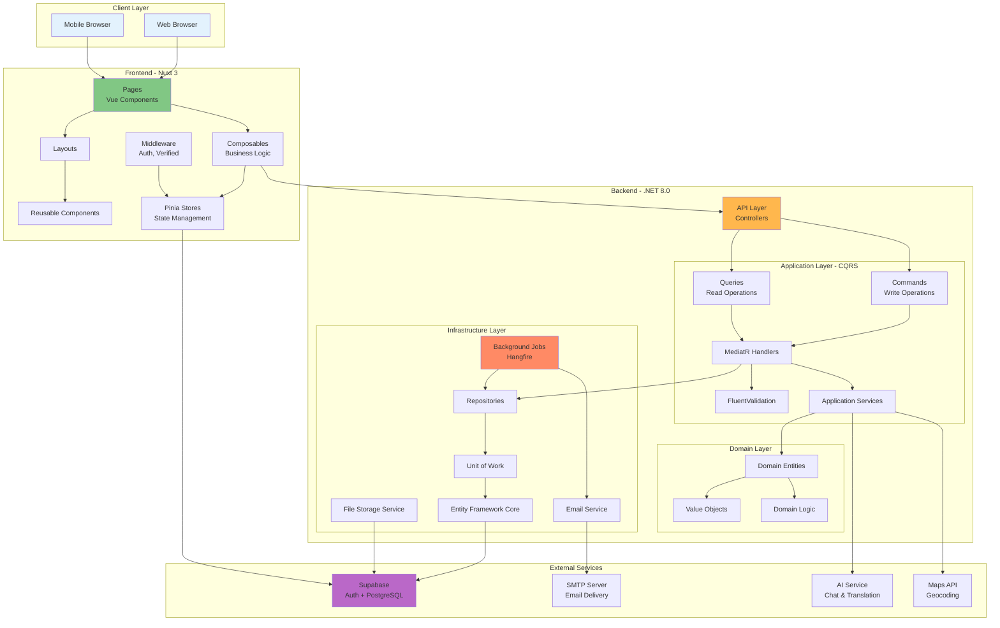
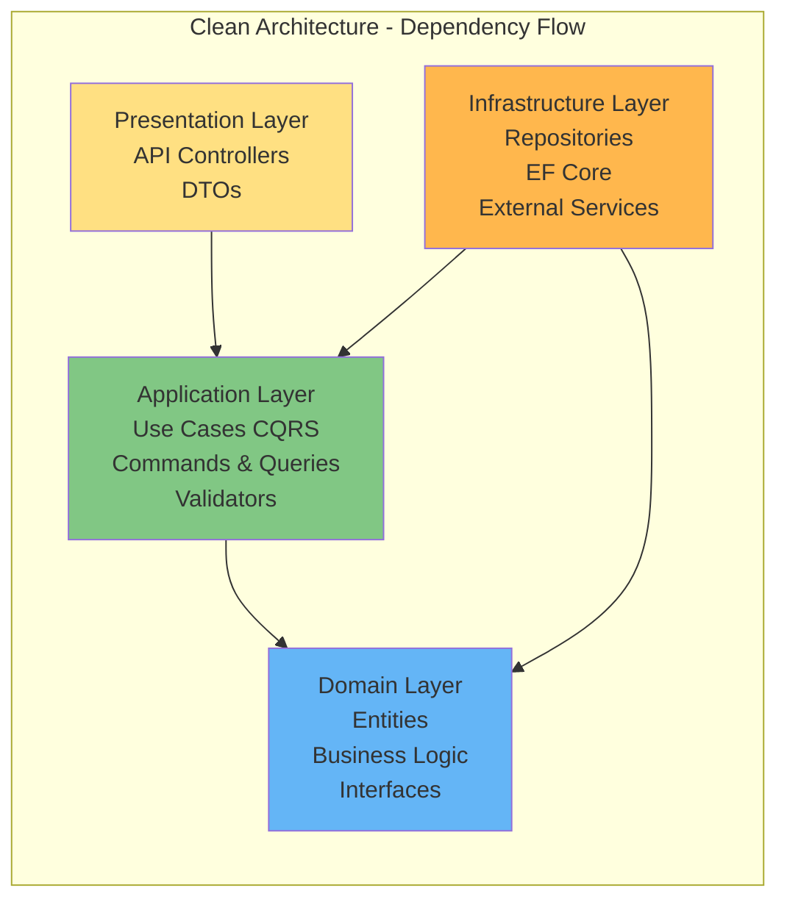
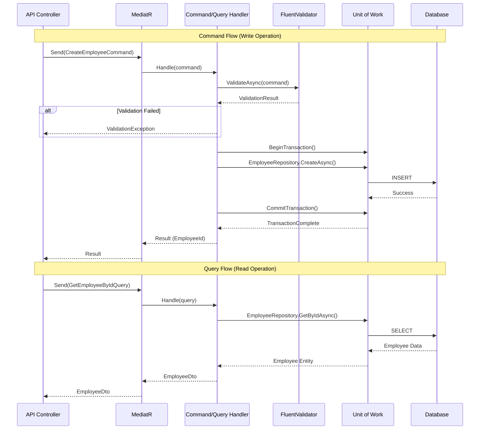
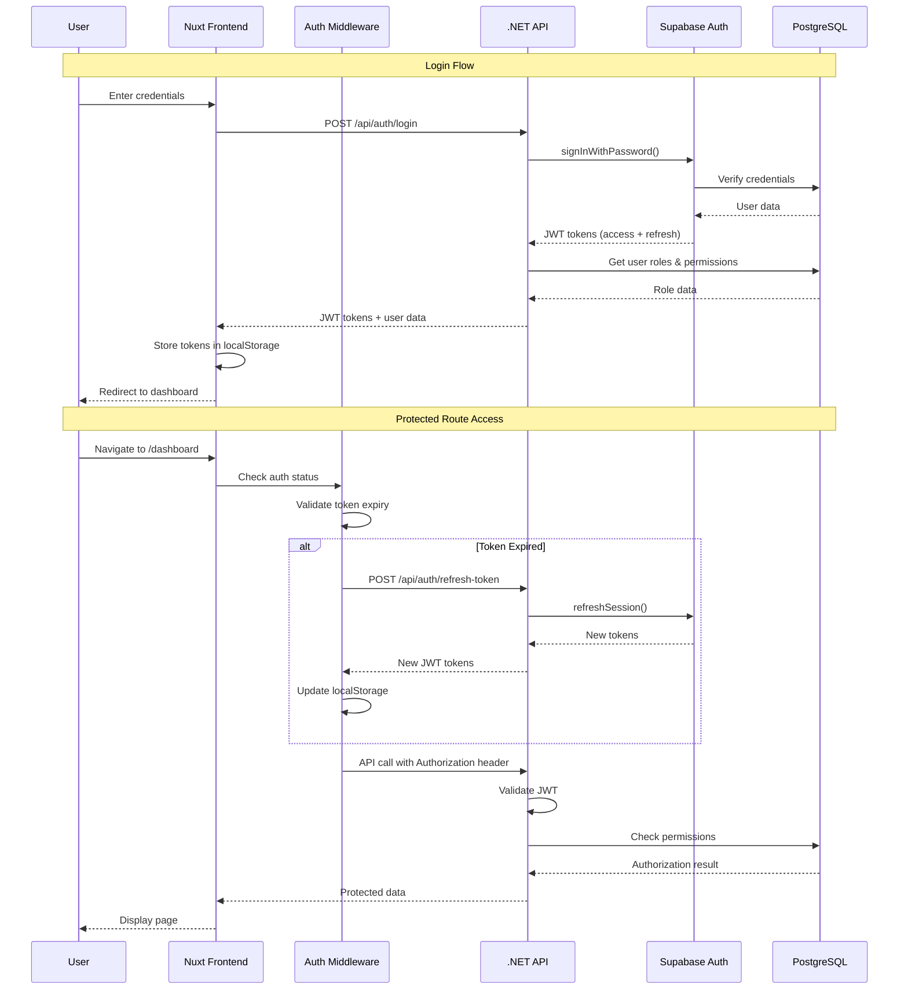
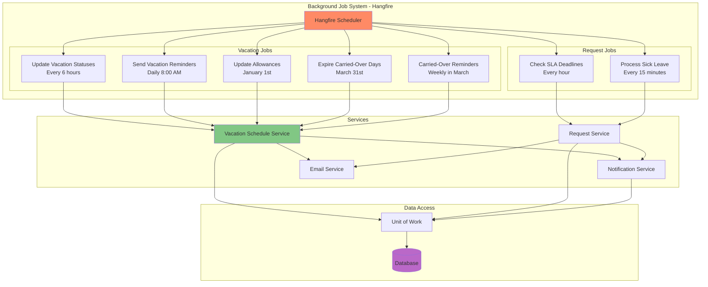
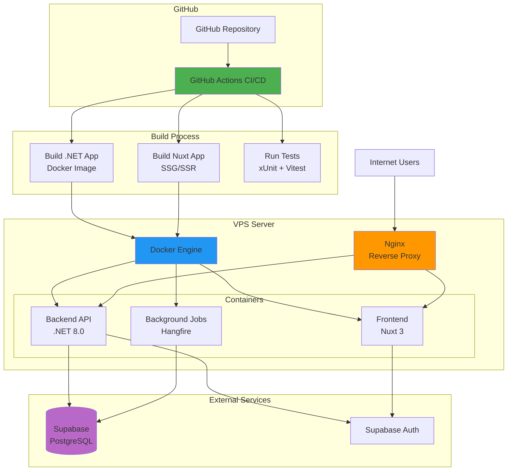
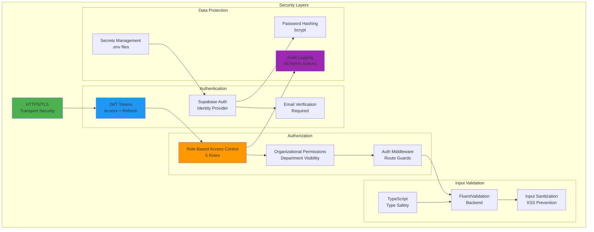

# PortalForge - System Architecture Diagram

## System Overview

This document provides comprehensive architecture diagrams for the PortalForge intranet portal system.

---

## 1. High-Level System Architecture

---

## 2. Clean Architecture Layers

**Key Principles:**
- **Domain** is the core - no dependencies on other layers
- **Application** orchestrates use cases, depends only on Domain
- **Infrastructure** implements interfaces defined in Domain/Application
- **Presentation** depends on Application, not on Infrastructure directly

---

## 3. CQRS Pattern with MediatR

---

## 4. Authentication Flow

---

## 5. Data Flow Architecture

```mermaid
graph LR
    subgraph "Frontend State Management"
        UserAction[User Action]
        Component[Vue Component]
        Composable[Composable]
        PiniaStore[Pinia Store]
    end

    subgraph "API Communication"
        HTTPClient[$fetch]
        APIEndpoint[REST API Endpoint]
    end

    subgraph "Backend Processing"
        Controller[Controller]
        MediatR[MediatR]
        Handler[Handler]
        Repository[Repository]
    end

    subgraph "Data Persistence"
        UnitOfWork[Unit of Work]
        EFCore[EF Core]
        Database[(PostgreSQL)]
    end

    UserAction --> Component
    Component --> Composable
    Composable --> PiniaStore
    PiniaStore --> HTTPClient
    HTTPClient --> APIEndpoint
    APIEndpoint --> Controller
    Controller --> MediatR
    MediatR --> Handler
    Handler --> Repository
    Repository --> UnitOfWork
    UnitOfWork --> EFCore
    EFCore --> Database

    Database -.->|Response| EFCore
    EFCore -.->|Entity| UnitOfWork
    UnitOfWork -.->|Data| Repository
    Repository -.->|DTO| Handler
    Handler -.->|Result| MediatR
    MediatR -.->|Result| Controller
    Controller -.->|JSON| APIEndpoint
    APIEndpoint -.->|Data| HTTPClient
    HTTPClient -.->|Update| PiniaStore
    PiniaStore -.->|Reactive| Component
    Component -.->|Render| UserAction

    style UserAction fill:#E1BEE7
    style Database fill:#BA68C8
    style Handler fill:#81C784
```

---

## 6. Background Jobs Architecture

---

## 7. Deployment Architecture

---

## 8. Security Architecture

---

## Technology Stack Summary

### Frontend
- **Framework**: Nuxt 3 (Vue 3 Composition API)
- **Language**: TypeScript
- **Styling**: Tailwind CSS
- **State Management**: Pinia
- **HTTP Client**: $fetch (Nuxt)
- **UI Components**: PrimeVue, custom components
- **Testing**: Vitest (unit), Playwright (E2E)

### Backend
- **Framework**: .NET 8.0 (LTS)
- **Architecture**: Clean Architecture + CQRS
- **Mediator**: MediatR
- **ORM**: Entity Framework Core
- **Validation**: FluentValidation
- **Logging**: Serilog
- **Background Jobs**: Hangfire
- **Testing**: xUnit, FluentAssertions, Moq

### Infrastructure
- **Database**: PostgreSQL (Supabase)
- **Authentication**: Supabase Auth
- **Hosting**: VPS with Docker
- **CI/CD**: GitHub Actions
- **Reverse Proxy**: Nginx
- **Email**: SMTP (configurable)

### External Services
- **Supabase**: Database + Auth + Storage
- **AI Service**: Chat and translation
- **Maps API**: Geocoding (Google Maps/OSM)
- **SMTP**: Email delivery

---

## Key Architectural Decisions

### 1. Clean Architecture
- **Why**: Separation of concerns, testability, maintainability
- **Benefit**: Easy to swap infrastructure components without affecting business logic

### 2. CQRS with MediatR
- **Why**: Separate read and write operations, single responsibility
- **Benefit**: Scalability, clear code organization, easier testing

### 3. Repository Pattern + Unit of Work
- **Why**: Abstract data access, manage transactions consistently
- **Benefit**: Testable, swappable data sources, transaction control

### 4. Supabase for Auth + DB
- **Why**: Managed PostgreSQL, built-in auth, rapid development
- **Benefit**: Reduced operational overhead, scalable, secure

### 5. Monorepo Structure
- **Why**: Single repository for frontend + backend + docs
- **Benefit**: Easier collaboration, shared docs, atomic commits

### 6. Background Jobs with Hangfire
- **Why**: Reliable job scheduling, persistent queues, retry logic
- **Benefit**: Automated tasks (vacation updates, reminders, SLA checks)

---

*Document created: 2025-11-07*
*Version: 1.0*
*For: PortalForge v2.5 - Architecture Documentation*
