# Diagram Podróży Użytkownika - PortalForge Authentication

## Analiza podróży użytkownika

<user_journey_analysis>

### Zidentyfikowane ścieżki użytkownika:

1. **Niezalogowany użytkownik odwiedzający aplikację**
   - Próba dostępu do chronionej strony
   - Przekierowanie do strony logowania
   - Wybór między logowaniem a rejestracją

2. **Nowy użytkownik - rejestracja**
   - Otwiera formularz rejestracji
   - Wypełnia dane (email, hasło)
   - Otrzymuje email weryfikacyjny
   - Klika link weryfikacyjny
   - Weryfikuje konto
   - Loguje się do systemu

3. **Istniejący użytkownik - logowanie**
   - Otwiera formularz logowania
   - Wprowadza dane uwierzytelniające
   - System weryfikuje dane
   - Użytkownik jest zalogowany
   - Przekierowanie do głównej strony

4. **Użytkownik, który zapomniał hasła**
   - Klika "Zapomniałeś hasła?"
   - Podaje email
   - Otrzymuje email z linkiem
   - Klika link resetujący
   - Ustawia nowe hasło
   - Loguje się z nowym hasłem

5. **Zalogowany użytkownik korzystający z aplikacji**
   - Dostęp do wszystkich chronione funkcji
   - Przeglądanie struktury organizacyjnej
   - Zarządzanie newsami i wydarzeniami
   - Wylogowanie z systemu

### Główne stany podróży użytkownika:

- **Niezalogowany**: Użytkownik nie ma aktywnej sesji
- **Na stronie logowania**: Użytkownik widzi formularz logowania
- **Na stronie rejestracji**: Użytkownik widzi formularz rejestracji
- **Oczekiwanie na weryfikację**: Konto utworzone, czeka na potwierdzenie emaila
- **Resetowanie hasła**: Proces odzyskiwania dostępu do konta
- **Zalogowany**: Użytkownik ma aktywną sesję i pełny dostęp
- **Wylogowany**: Użytkownik zakończył sesję

### Punkty decyzyjne:

1. **Czy użytkownik ma konto?**
   - TAK → Przejdź do logowania
   - NIE → Przejdź do rejestracji

2. **Czy dane logowania są prawidłowe?**
   - TAK → Zaloguj użytkownika
   - NIE → Wyświetl błąd, pozwól na ponowną próbę

3. **Czy użytkownik zweryfikował email?**
   - TAK → Pozwól na logowanie
   - NIE → Pokaż komunikat o konieczności weryfikacji

4. **Czy token resetowania jest ważny?**
   - TAK → Pozwól na ustawienie nowego hasła
   - NIE → Wyświetl błąd i zaproponuj ponowne wysłanie linku

5. **Czy sesja jest aktywna?**
   - TAK → Kontynuuj korzystanie z aplikacji
   - NIE → Przekieruj do logowania

### Cel każdego stanu:

- **Niezalogowany**: Ochrona zasobów aplikacji przed nieautoryzowanym dostępem
- **Logowanie**: Weryfikacja tożsamości użytkownika
- **Rejestracja**: Utworzenie nowego konta użytkownika
- **Weryfikacja emaila**: Potwierdzenie autentyczności adresu email
- **Resetowanie hasła**: Odzyskanie dostępu do konta
- **Zalogowany**: Umożliwienie korzystania z pełnej funkcjonalności systemu
- **Wylogowanie**: Bezpieczne zakończenie sesji

</user_journey_analysis>

## Diagram stanów podróży użytkownika

```mermaid
stateDiagram-v2
    [*] --> Niezalogowany

    state "Niezalogowany" as Niezalogowany {
        [*] --> PróbaDostępu
        PróbaDostępu --> SprawdzenieAutoryzacji

        state if_autoryzacja <<choice>>
        SprawdzenieAutoryzacji --> if_autoryzacja
        if_autoryzacja --> PrzekierowanieDoLogowania: Brak sesji
        if_autoryzacja --> DostępDoAplikacji: Sesja aktywna
    }

    state "Proces Autentykacji" as ProcesAuth {
        [*] --> WyborOpcji

        state if_wybor <<choice>>
        WyborOpcji --> if_wybor
        if_wybor --> StronaLogowania: Ma konto
        if_wybor --> StronaRejestracji: Nie ma konta
        if_wybor --> StronaResetowaniaHasla: Zapomniał hasła

        state "Logowanie" as Logowanie {
            [*] --> FormularzLogowania
            FormularzLogowania --> WalidacjaDanychLogowania
            WalidacjaDanychLogowania --> WyslanieZadaniaLogowania

            state if_login <<choice>>
            WyslanieZadaniaLogowania --> if_login
            if_login --> FormularzLogowania: Błąd walidacji
            if_login --> WeryfikacjaPoswiadczen: Dane prawidłowe

            state if_credentials <<choice>>
            WeryfikacjaPoswiadczen --> if_credentials
            if_credentials --> FormularzLogowania: Błędne dane
            if_credentials --> TworzenieeSesji: Dane prawidłowe

            TworzenieeSesji --> UstawianieTokenow
            UstawianieTokenow --> [*]
        }

        state "Rejestracja" as Rejestracja {
            [*] --> FormularzRejestracji
            FormularzRejestracji --> WalidacjaDanychRejestracji
            WalidacjaDanychRejestracji --> WyslanieZadaniaRejestracji

            state if_register <<choice>>
            WyslanieZadaniaRejestracji --> if_register
            if_register --> FormularzRejestracji: Błąd walidacji
            if_register --> TworzenieKonta: Dane prawidłowe

            state if_email_exists <<choice>>
            TworzenieKonta --> if_email_exists
            if_email_exists --> FormularzRejestracji: Email już istnieje
            if_email_exists --> WyslanieEmailaWeryfikacyjnego: Email unikalny

            WyslanieEmailaWeryfikacyjnego --> OczekiwanieNaWeryfikacje
            OczekiwanieNaWeryfikacje --> [*]
        }

        state "Weryfikacja Email" as WeryfikacjaEmail {
            [*] --> KlikniecieLinkuWeryfikacyjnego
            KlikniecieLinkuWeryfikacyjnego --> SprawdzenieTokenuWeryfikacji

            state if_token_verify <<choice>>
            SprawdzenieTokenuWeryfikacji --> if_token_verify
            if_token_verify --> BladWeryfikacji: Token nieważny
            if_token_verify --> AktywacjaKonta: Token ważny

            BladWeryfikacji --> [*]
            AktywacjaKonta --> KontoZweryfikowane
            KontoZweryfikowane --> [*]
        }

        state "Resetowanie Hasła" as ResetowanieHasla {
            [*] --> FormularzResetowania
            FormularzResetowania --> PodanieEmaila
            PodanieEmaila --> WyslanieEmailaResetujacego
            WyslanieEmailaResetujacego --> OczekiwanieNaKlikniecieLInku

            OczekiwanieNaKlikniecieLInku --> KlikniecieLinkuResetujacego
            KlikniecieLinkuResetujacego --> SprawdzenieTokenuResetowania

            state if_token_reset <<choice>>
            SprawdzenieTokenuResetowania --> if_token_reset
            if_token_reset --> BladResetowania: Token nieważny lub wygasły
            if_token_reset --> FormularzNowegoHasla: Token ważny

            BladResetowania --> [*]

            FormularzNowegoHasla --> PodanieNowegoHasla
            PodanieNowegoHasla --> WalidacjaNowegoHasla

            state if_password_valid <<choice>>
            WalidacjaNowegoHasla --> if_password_valid
            if_password_valid --> FormularzNowegoHasla: Hasło za słabe
            if_password_valid --> AktualizacjaHasla: Hasło prawidłowe

            AktualizacjaHasla --> Uniewaznieniesji
            Uniewaznieniesji --> HasloZmienione
            HasloZmienione --> [*]
        }

        StronaLogowania --> Logowanie
        StronaRejestracji --> Rejestracja
        StronaResetowaniaHasla --> ResetowanieHasla

        Logowanie --> SesjaAktywna
        Rejestracja --> WeryfikacjaEmail
        WeryfikacjaEmail --> StronaLogowania: Po weryfikacji
        ResetowanieHasla --> StronaLogowania: Po zmianie hasła
    }

    state "Zalogowany Użytkownik" as Zalogowany {
        [*] --> DashboardGlowny

        state "Korzystanie z Aplikacji" as KorzystanieZAplikacji {
            [*] --> PrzegladanieStruktury

            state fork_functions <<fork>>
            state join_functions <<join>>

            PrzegladanieStruktury --> fork_functions

            fork_functions --> PrzegladaniePracownikow
            fork_functions --> ZarzadzanieNewsami
            fork_functions --> ZarzadzanieWydarzeniami
            fork_functions --> EdycjaProfiluUzytkownika

            PrzegladaniePracownikow --> join_functions
            ZarzadzanieNewsami --> join_functions
            ZarzadzanieWydarzeniami --> join_functions
            EdycjaProfiluUzytkownika --> join_functions

            join_functions --> DashboardGlowny
        }

        DashboardGlowny --> KorzystanieZAplikacji
        KorzystanieZAplikacji --> DashboardGlowny

        state "Sprawdzanie Sesji" as SprawdzanieSesji {
            [*] --> WeryfikacjaTokenu

            state if_token_valid <<choice>>
            WeryfikacjaTokenu --> if_token_valid
            if_token_valid --> KontynuujSesje: Token ważny
            if_token_valid --> ProbaOdswiezenia: Token wygasły

            state if_refresh <<choice>>
            ProbaOdswiezenia --> if_refresh
            if_refresh --> AktualizacjaTokenu: Refresh token ważny
            if_refresh --> WymuszenieWylogowania: Refresh token nieważny

            AktualizacjaTokenu --> KontynuujSesje
            KontynuujSesje --> [*]
            WymuszenieWylogowania --> [*]
        }

        DashboardGlowny --> SprawdzanieSesji: Każde żądanie
        SprawdzanieSesji --> DashboardGlowny: Sesja aktywna
        SprawdzanieSesji --> ProcesWylogowania: Sesja nieważna

        DashboardGlowny --> ProcesWylogowania: Przycisk Wyloguj

        state "Wylogowanie" as ProcesWylogowania {
            [*] --> ZadanieWylogowania
            ZadanieWylogowania --> UniewaznieneSesji
            UniewaznieneSesji --> UsuniecieCiasteczek
            UsuniecieCiasteczek --> Wyczyszczeniestanu
            Wyczyszczeniestanu --> [*]
        }
    }

    PrzekierowanieDoLogowania --> ProcesAuth
    ProcesAuth --> Zalogowany: Sukces logowania
    Zalogowany --> Niezalogowany: Wylogowanie
    Niezalogowany --> ProcesAuth: Próba logowania

    state if_timeout <<choice>>
    Zalogowany --> if_timeout: 8h nieaktywności
    if_timeout --> ProcesWylogowania: Timeout sesji
    if_timeout --> Zalogowany: Aktywność kontynuowana

    ProcesWylogowania --> [*]

    note right of Niezalogowany
        Stan domyślny dla nowych użytkowników
        oraz po wylogowaniu z systemu
    end note

    note left of ProcesAuth
        Proces autentykacji obejmuje
        logowanie, rejestrację i
        resetowanie hasła
    end note

    note right of Zalogowany
        Użytkownik ma pełny dostęp
        do funkcjonalności systemu
        przez 8h od ostatniej aktywności
    end note
```

## Opis diagramu

Diagram przedstawia pełną podróż użytkownika w systemie PortalForge od momentu pierwszej wizyty do korzystania z aplikacji.

### Główne stany:

1. **Niezalogowany**: Użytkownik bez aktywnej sesji, który próbuje uzyskać dostęp do aplikacji
2. **Proces Autentykacji**: Kompleksowy stan obejmujący:
   - Logowanie istniejącego użytkownika
   - Rejestrację nowego użytkownika z weryfikacją emaila
   - Resetowanie zapomnianego hasła
3. **Zalogowany Użytkownik**: Użytkownik z aktywną sesją, korzystający z pełnej funkcjonalności

### Kluczowe przepływy:

- **Rejestracja → Weryfikacja → Logowanie**: Nowy użytkownik przechodzi przez pełny proces od utworzenia konta do pierwszego logowania
- **Logowanie → Korzystanie**: Istniejący użytkownik loguje się i uzyskuje dostęp do aplikacji
- **Zapomniałeś hasła → Reset → Logowanie**: Użytkownik odzyskuje dostęp do konta
- **Automatyczne wylogowanie**: Po 8h nieaktywności użytkownik jest wylogowywany
- **Odświeżanie tokenu**: Automatyczne odświeżanie sesji przy wygaśnięciu access_token

### Punkty decyzyjne:

Diagram zawiera wiele punktów decyzyjnych (choice), które określają alternatywne ścieżki na podstawie:
- Ważności tokenów
- Poprawności danych uwierzytelniających
- Unikalności emaila przy rejestracji
- Ważności linków weryfikacyjnych i resetujących
