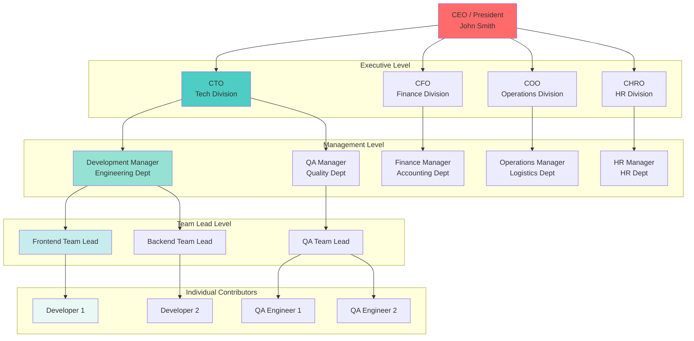
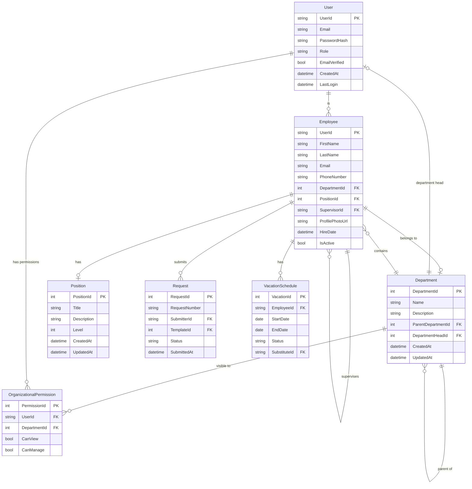
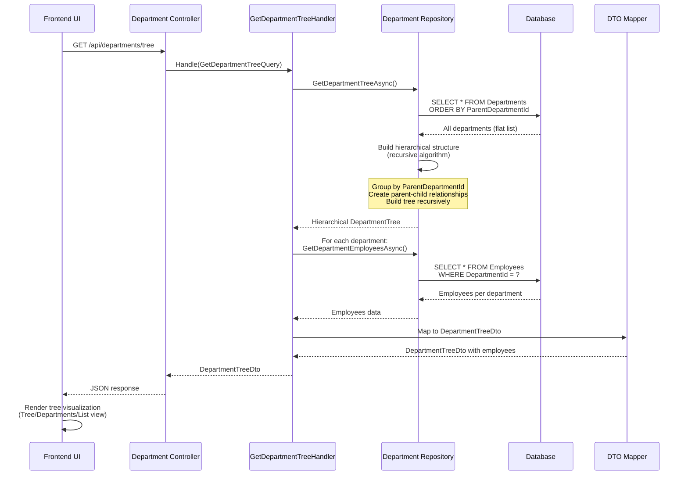
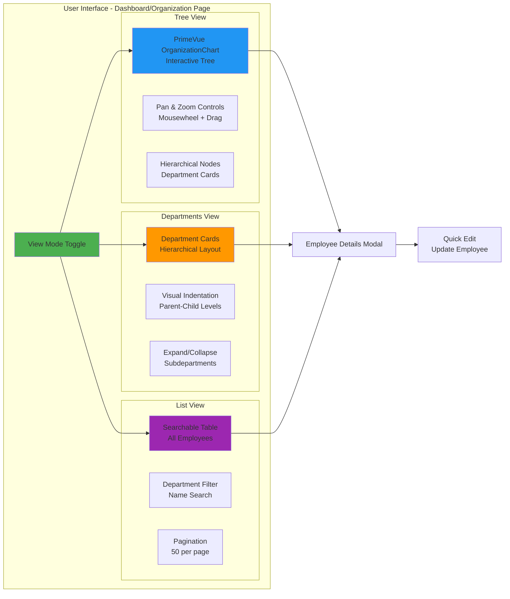
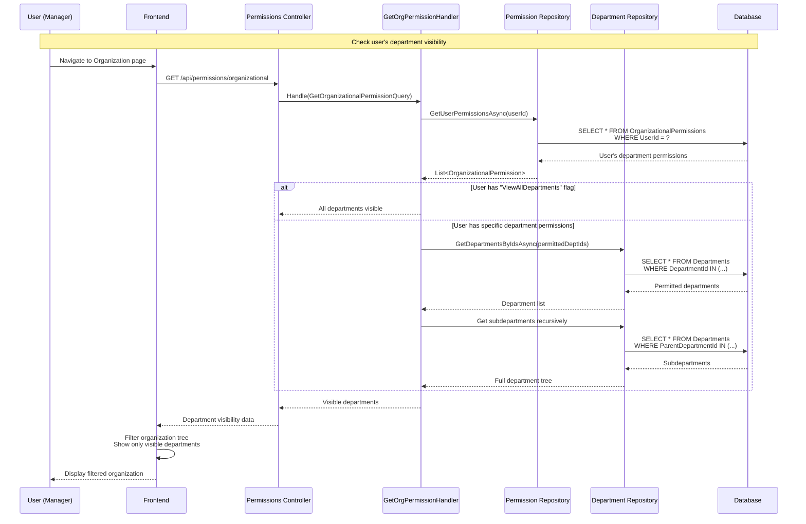
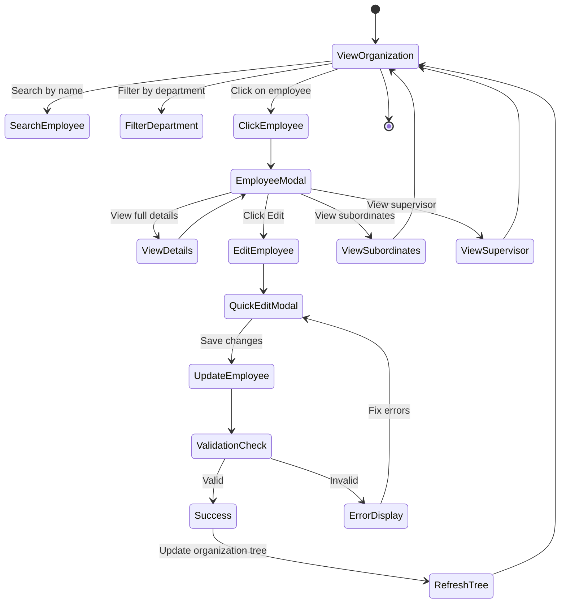
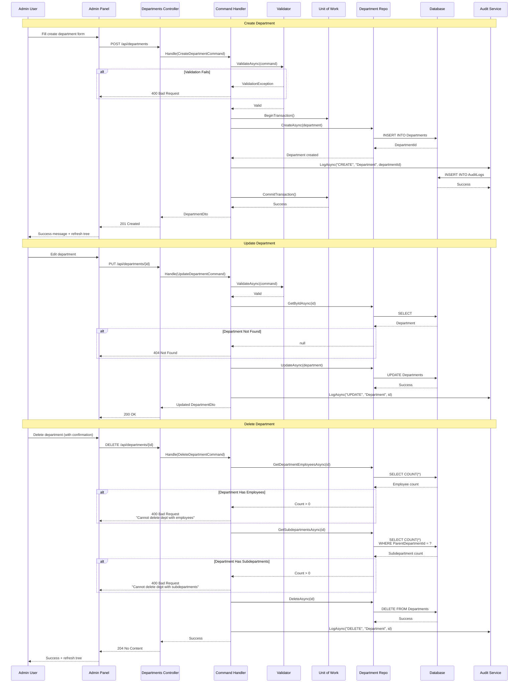
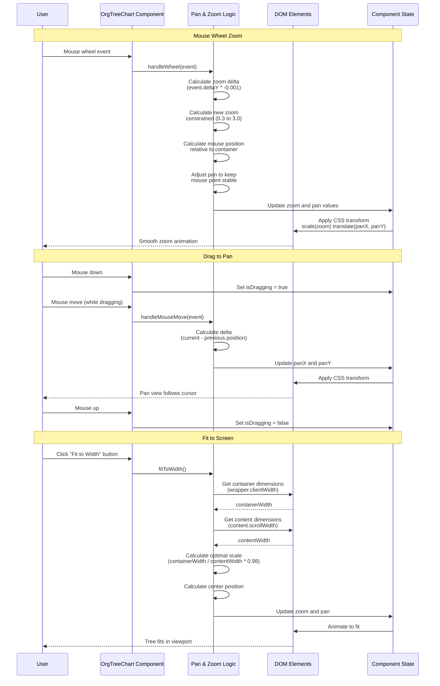

# PortalForge - Organizational Structure System

## System Overview

This document provides comprehensive diagrams for the organizational structure management system in PortalForge.

---

## 1. Organizational Hierarchy Model



---

## 2. Data Model - Entity Relationships



---

## 3. Department Tree Query Flow



---

## 4. Three Visualization Modes



---

## 5. Organizational Permissions System



---

## 6. Employee Management Flow



---

## 7. Department CRUD Operations



---

## 8. Transfer Employee Between Departments

```mermaid
flowchart TD
    Start([Admin initiates<br/>employee transfer])

    SelectEmployee[Select employee<br/>to transfer]
    SelectTarget[Select target<br/>department]

    ValidateTarget{Target dept<br/>exists?}
    ValidateEmployee{Employee<br/>exists?}
    ValidateSupervisor{New supervisor<br/>in target dept?}

    SelectEmployee --> ValidateEmployee
    ValidateEmployee -->|No| ErrorNotFound[Error: Employee not found]
    ValidateEmployee -->|Yes| SelectTarget

    SelectTarget --> ValidateTarget
    ValidateTarget -->|No| ErrorDeptNotFound[Error: Department not found]
    ValidateTarget -->|Yes| ValidateSupervisor

    ValidateSupervisor -->|No| PromptSupervisor[Prompt: Assign<br/>new supervisor]
    ValidateSupervisor -->|Yes| BeginTransaction

    PromptSupervisor --> BeginTransaction[Begin Database<br/>Transaction]

    BeginTransaction --> UpdateEmployee[Update Employee:<br/>- DepartmentId<br/>- SupervisorId]

    UpdateEmployee --> UpdatePermissions[Update Organizational<br/>Permissions if needed]

    UpdatePermissions --> RecalcReports[Recalculate<br/>reporting structure]

    RecalcReports --> AuditLog[Create Audit Log:<br/>"TRANSFER" action]

    AuditLog --> Notify[Send notification:<br/>- Employee<br/>- Old supervisor<br/>- New supervisor]

    Notify --> CommitTransaction[Commit Transaction]

    CommitTransaction --> RefreshUI[Refresh organization<br/>tree in UI]

    RefreshUI --> End([Transfer Complete])

    ErrorNotFound --> End
    ErrorDeptNotFound --> End

    style Start fill:#4CAF50
    style End fill:#4CAF50
    style BeginTransaction fill:#2196F3
    style CommitTransaction fill:#2196F3
    style ErrorNotFound fill:#F44336
    style ErrorDeptNotFound fill:#F44336
```

---

## 9. Pan & Zoom Implementation (Tree View)



---

## Key Features

### ✅ Implemented

1. **Unlimited Hierarchy Depth**: Supports any level of organizational structure
2. **Three Visualization Modes**: Tree (pan & zoom), Departments (cards), List (table)
3. **Department CRUD**: Create, read, update, delete departments with validation
4. **Employee Management**: Full CRUD operations for employees
5. **Organizational Permissions**: Control who can view which departments
6. **Supervisor Assignment**: Automatic handling of reporting relationships
7. **Transfer Employees**: Move employees between departments with supervisor reassignment
8. **Search & Filter**: Real-time search by name, filter by department
9. **Profile Photos**: Upload photos with fallback to initials
10. **Audit Logging**: All administrative actions tracked
11. **Department Heads**: Assign and manage department heads
12. **Bulk Operations**: Bulk assign department, transfer multiple employees

### ⚠️ Partial Implementation

- **Export to PDF/Excel**: UI buttons exist, backend returns 501 Not Implemented

### Technology Stack

**Backend:**
- GetDepartmentTree query - hierarchical structure builder
- Department repository with recursive queries
- Organizational permissions validation
- Audit logging for all CRUD operations

**Frontend:**
- PrimeVue OrganizationChart component
- Custom pan & zoom implementation
- Three view modes: Tree, Departments, List
- Employee and department modals
- Real-time search and filtering

---

*Document created: 2025-11-07*
*Version: 1.0*
*For: PortalForge v2.5 - Organizational Structure Documentation*
