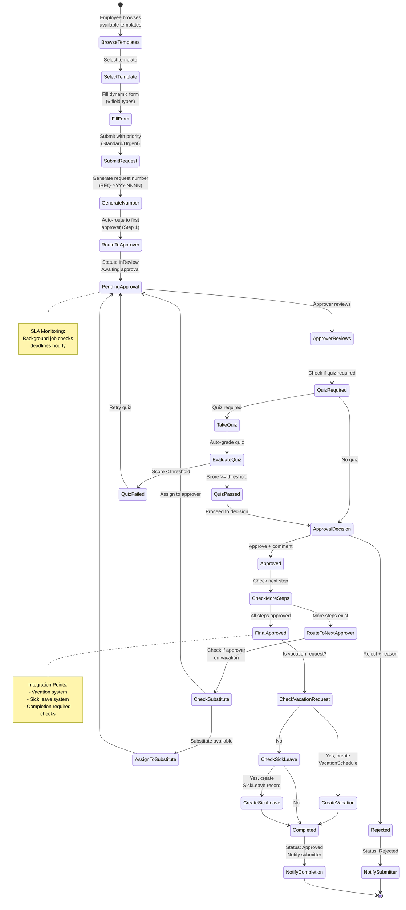
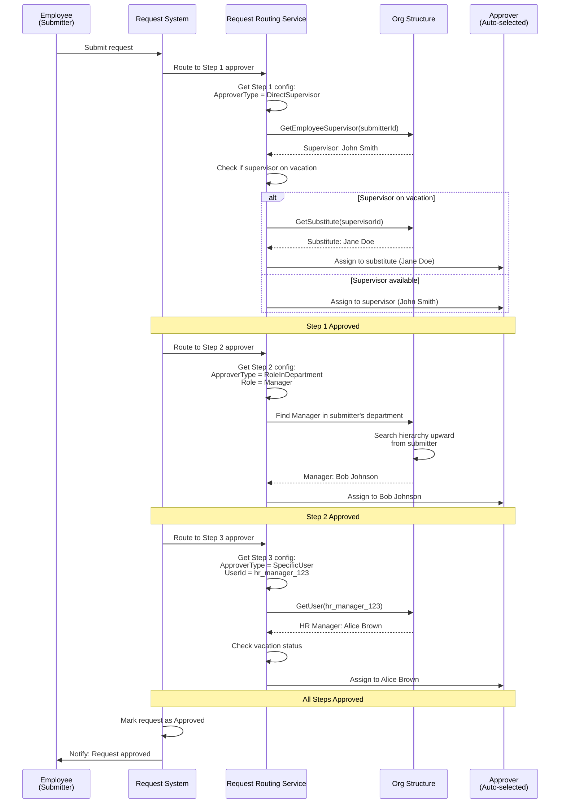
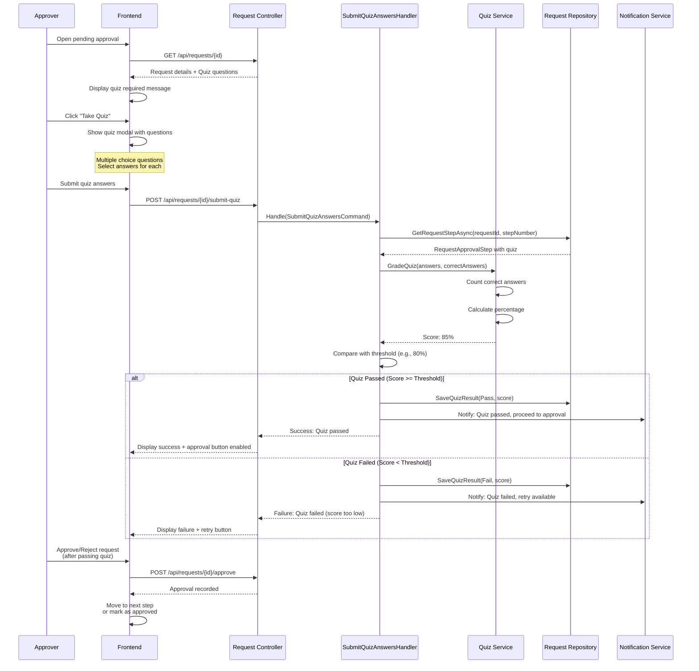
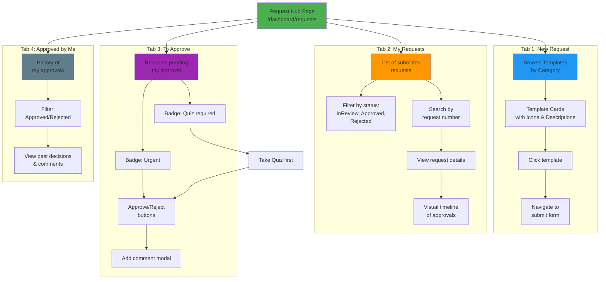
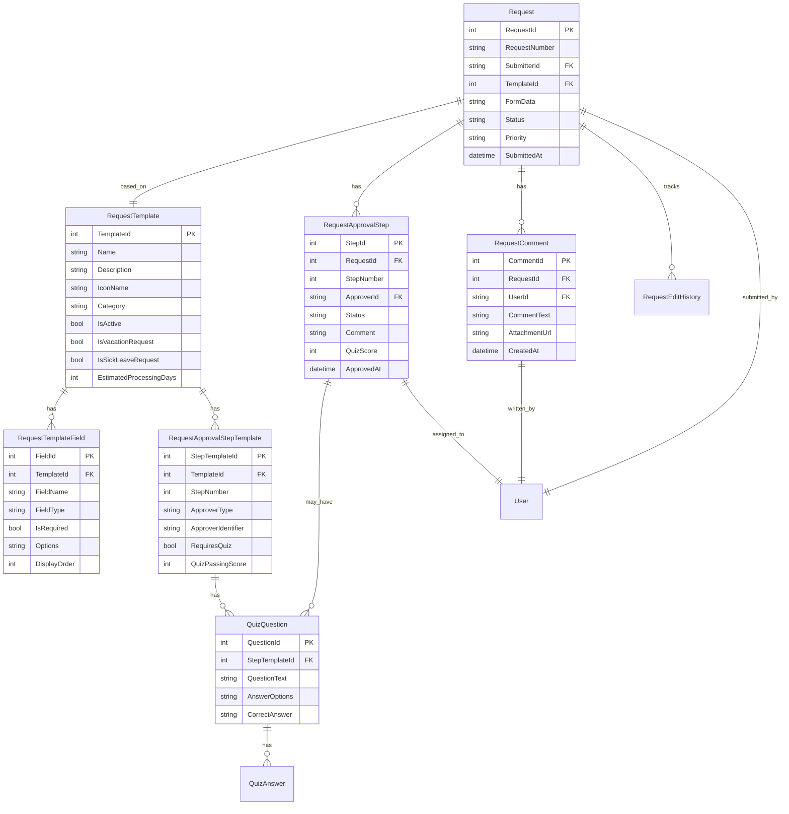

# PortalForge - Request Workflow System

## System Overview

Advanced request management system with configurable templates, multi-step approval workflow, quiz functionality, and intelligent routing.

---

## 1. Request Lifecycle



---

## 2. Request Template Configuration

```mermaid
graph TB
    subgraph "Admin: Create Request Template"
        Start[Admin Panel]

        BasicInfo[Template Basic Info:<br/>- Name<br/>- Description<br/>- Icon Iconify<br/>- Category]

        Visibility[Visibility Settings:<br/>- All Departments<br/>- Specific Departments<br/>- Global/Department scope]

        FormBuilder[Form Builder:<br/>6 Field Types]

        subgraph "Dynamic Form Fields"
            Text[Text Input]
            Textarea[Textarea]
            Number[Number Input]
            Select[Select Dropdown]
            Date[Date Picker]
            Checkbox[Checkbox]
        end

        ApprovalSteps[Approval Workflow<br/>Step Editor]

        subgraph "Approval Step Configuration"
            Step1[Step 1: Direct Supervisor]
            Step2[Step 2: Department Head]
            Step3[Step 3: HR Manager]
            StepN[Step N: Custom...]
        end

        ApproverTypes[6 Approver Types:<br/>- Supervisor<br/>- Role Dept<br/>- Specific User<br/>- Department Head<br/>- User Group<br/>- Submitter]

        QuizConfig[Quiz Configuration<br/>Optional per step]

        subgraph "Quiz Settings"
            Questions[Quiz Questions<br/>Multiple choice]
            Answers[Mark correct answers]
            Threshold[Pass threshold %]
        end

        SpecialFlags[Special Flags:<br/>- IsVacationRequest<br/>- IsSickLeaveRequest]

        Save[Save Template]
    end

    Start --> BasicInfo
    BasicInfo --> Visibility
    Visibility --> FormBuilder

    FormBuilder --> Text
    FormBuilder --> Textarea
    FormBuilder --> Number
    FormBuilder --> Select
    FormBuilder --> Date
    FormBuilder --> Checkbox

    Text --> ApprovalSteps
    Textarea --> ApprovalSteps
    Number --> ApprovalSteps
    Select --> ApprovalSteps
    Date --> ApprovalSteps
    Checkbox --> ApprovalSteps

    ApprovalSteps --> Step1
    ApprovalSteps --> Step2
    ApprovalSteps --> Step3
    ApprovalSteps --> StepN

    Step1 --> ApproverTypes
    Step2 --> ApproverTypes
    Step3 --> ApproverTypes

    ApproverTypes --> QuizConfig

    QuizConfig --> Questions
    Questions --> Answers
    Answers --> Threshold

    Threshold --> SpecialFlags
    SpecialFlags --> Save

    style Start fill:#4CAF50
    style FormBuilder fill:#2196F3
    style ApprovalSteps fill:#FF9800
    style QuizConfig fill:#9C27B0
    style Save fill:#4CAF50
```



---

## 3. Auto-Routing in Organizational Hierarchy



---

## 4. Quiz System Integration



---

## 5. SLA Monitoring & Escalation

```mermaid
flowchart TD
    Start([Background Job:<br/>Check SLA Deadlines<br/>Hourly])

    GetPendingRequests[Get all requests<br/>in InReview status]

    GetPendingRequests --> LoopRequests[For each request]

    LoopRequests --> GetCurrentStep[Get current<br/>approval step]

    GetCurrentStep --> CheckDeadline{Has deadline<br/>& overdue?}

    CheckDeadline -->|No| NextRequest[Next request]
    CheckDeadline -->|Yes| CalculateOverdue[Calculate days overdue]

    CalculateOverdue --> CheckAlreadyNotified{Reminder already<br/>sent today?}

    CheckAlreadyNotified -->|Yes| NextRequest
    CheckAlreadyNotified -->|No| SendReminder[Send SLA reminder<br/>to approver]

    SendReminder --> CreateNotification[Create notification:<br/>"Approval overdue"]

    CreateNotification --> SendEmail[Send email reminder]

    SendEmail --> LogReminder[Log reminder sent<br/>(timestamp)]

    LogReminder --> CheckEscalation{Days overdue<br/>> 3?}

    CheckEscalation -->|No| NextRequest
    CheckEscalation -->|Yes| EscalateToSupervisor[Escalate to<br/>approver's supervisor]

    EscalateToSupervisor --> NotifySupervisor[Notify supervisor<br/>of overdue approval]

    NotifySupervisor --> NextRequest

    NextRequest --> MoreRequests{More requests?}

    MoreRequests -->|Yes| LoopRequests
    MoreRequests -->|No| End([Job Complete])

    style Start fill:#FF8A65
    style SendReminder fill:#FF9800
    style EscalateToSupervisor fill:#E91E63
    style End fill:#4CAF50
```

---

## 6. Request UI - Four Tabs



---

## 7. Data Model



---

## Key Features

### ✅ Fully Implemented (100%)

1. **Configurable Templates**: Admin panel for creating templates with drag-and-drop field builder
2. **6 Field Types**: Text, Textarea, Number, Select, Date, Checkbox
3. **Multi-Step Approval**: Unlimited approval steps with sequential workflow
4. **6 Approver Types**: Supervisor, Role, Specific User, Department, User Group, Submitter
5. **Quiz System**: Multiple-choice quizzes with auto-grading and pass thresholds
6. **Auto-Routing**: Intelligent routing based on organizational hierarchy
7. **Vacation Substitution**: Automatic routing to substitutes when approver on vacation
8. **Vacation Integration**: Auto-create VacationSchedule from approved vacation requests
9. **Sick Leave L4**: Auto-approval flow with SickLeave record creation
10. **Comments & Attachments**: Full commenting system with file uploads
11. **Edit History**: Complete audit trail of all request changes
12. **SLA Monitoring**: Background job checking deadlines with reminders
13. **Request Hub**: 4 tabs (New Request, My Requests, To Approve, Approved by Me)
14. **Visual Timeline**: Step-by-step approval progress visualization
15. **Priority Levels**: Standard/Urgent with visual badges
16. **Status Tracking**: Draft, InReview, Approved, Rejected, AwaitingSurvey
17. **Department Scope**: Templates visible to all or specific departments

### Technology

**Backend:**
- Request routing service with hierarchy traversal
- Quiz grading service
- SLA deadline checker (background job)
- Vacation/sick leave integration
- FluentValidation for all commands

**Frontend:**
- Dynamic form builder
- Approval step editor with drag-and-drop
- Quiz modal with real-time grading
- Request timeline visualization
- Comment system with attachments

---

*Document created: 2025-11-07*
*Version: 1.0*
*For: PortalForge v2.5 - Request Workflow Documentation*
