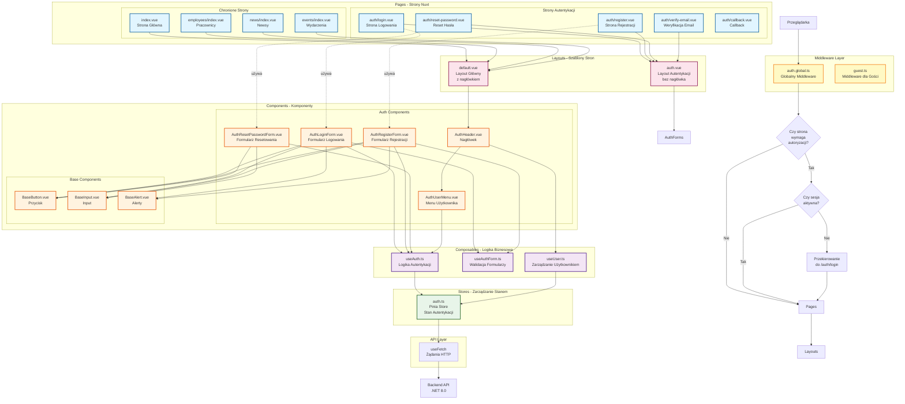

# Diagram Architektury UI - PortalForge Authentication

## Analiza architektury UI

<architecture_analysis>

### Zidentyfikowane komponenty UI:

**Strony Nuxt (pages/):**
1. `/auth/login.vue` - Strona logowania
2. `/auth/register.vue` - Strona rejestracji
3. `/auth/reset-password.vue` - Strona resetowania hasła
4. `/auth/verify-email.vue` - Strona weryfikacji emaila
5. `/auth/callback.vue` - Strona callback po weryfikacji
6. `/index.vue` - Strona główna (wymaga autoryzacji)
7. `/employees/index.vue` - Lista pracowników (wymaga autoryzacji)
8. `/news/index.vue` - Lista newsów (wymaga autoryzacji)
9. `/events/index.vue` - Lista wydarzeń (wymaga autoryzacji)

**Komponenty React/Vue (components/):**
1. `AuthLoginForm.vue` - Formularz logowania
2. `AuthRegisterForm.vue` - Formularz rejestracji
3. `AuthResetPasswordForm.vue` - Formularz resetowania hasła
4. `AuthHeader.vue` - Nagłówek z przyciskiem logowania/wylogowania
5. `AuthUserMenu.vue` - Menu użytkownika (avatar, email, wyloguj)
6. `BaseButton.vue` - Przycisk bazowy
7. `BaseInput.vue` - Input bazowy
8. `BaseAlert.vue` - Komponent alertów i komunikatów

**Layouts (layouts/):**
1. `default.vue` - Layout główny (z AuthHeader)
2. `auth.vue` - Layout dla stron autentykacji (bez nagłówka)

**Composables (composables/):**
1. `useAuth.ts` - Logika autentykacji
2. `useAuthForm.ts` - Walidacja formularzy
3. `useUser.ts` - Zarządzanie stanem użytkownika

**Stores (stores/):**
1. `auth.ts` - Pinia store dla stanu autentykacji

**Middleware (middleware/):**
1. `auth.global.ts` - Globalny middleware autentykacji
2. `guest.ts` - Middleware dla gości (przekierowanie zalogowanych)

### Przepływ danych między komponentami:

```
Browser
  ↓
Pages (Nuxt)
  ↓
Middleware (auth.global.ts)
  ↓
Layouts (default.vue / auth.vue)
  ↓
Components (Forms, Headers, Menus)
  ↓
Composables (useAuth, useUser)
  ↓
Stores (Pinia auth store)
  ↓
API Calls (useFetch)
  ↓
Backend API (.NET)
```

### Funkcjonalność komponentów:

**AuthLoginForm.vue:**
- Wyświetla formularz logowania (email, hasło)
- Waliduje dane po stronie klienta
- Wysyła żądanie logowania do API
- Obsługuje błędy i wyświetla komunikaty
- Przekierowuje po sukcesie

**AuthRegisterForm.vue:**
- Wyświetla formularz rejestracji (email, hasło, potwierdzenie)
- Waliduje siłę hasła i zgodność haseł
- Wysyła żądanie rejestracji do API
- Informuje o konieczności weryfikacji emaila

**AuthHeader.vue:**
- Wyświetla przycisk "Zaloguj się" dla niezalogowanych
- Wyświetla AuthUserMenu dla zalogowanych
- Reaguje na zmiany stanu autentykacji

**AuthUserMenu.vue:**
- Wyświetla avatar użytkownika
- Pokazuje email użytkownika
- Zawiera przycisk wylogowania
- Obsługuje proces wylogowania

**useAuth.ts:**
- Centralizuje logikę autentykacji
- Udostępnia metody: login(), register(), logout(), resetPassword()
- Zarządza stanem ładowania i błędów
- Współpracuje z Pinia store

**auth.ts (Pinia):**
- Przechowuje dane użytkownika
- Przechowuje stan sesji (isAuthenticated)
- Udostępnia gettery dla danych użytkownika
- Synchronizuje stan między komponentami

**auth.global.ts (Middleware):**
- Sprawdza autoryzację przed każdym żądaniem
- Weryfikuje czy strona wymaga logowania
- Przekierowuje niezalogowanych do /auth/login
- Pobiera dane użytkownika z API

</architecture_analysis>

## Diagram architektury UI



## Szczegółowy opis komponentów

### 1. Warstwa Middleware

**auth.global.ts:**
- Interceptuje każde żądanie nawigacji
- Sprawdza czy route wymaga autoryzacji
- Weryfikuje aktywną sesję użytkownika
- Przekierowuje do /auth/login jeśli brak autoryzacji
- Pobiera dane użytkownika z backend API

**guest.ts:**
- Middleware dla stron dostępnych tylko dla niezalogowanych
- Przekierowuje zalogowanych użytkowników do strony głównej
- Używany na stronach: login, register, reset-password

### 2. Warstwa Pages (Strony)

**Strony autentykacji:**
- Używają `auth.vue` layout (bez nagłówka)
- Zawierają dedykowane formularze
- Obsługują przekierowania po sukcesie
- Nie wymagają aktywnej sesji

**Chronione strony:**
- Używają `default.vue` layout (z nagłówkiem)
- Wymagają aktywnej sesji (middleware)
- Mają dostęp do danych użytkownika
- Wyświetlają AuthUserMenu w nagłówku

### 3. Warstwa Layouts

**default.vue:**
- Layout dla zalogowanych użytkowników
- Zawiera AuthHeader z przyciskiem wylogowania
- Renderuje sloty dla zawartości strony
- Globalny dostęp do AuthStore

**auth.vue:**
- Minimalistyczny layout dla stron autoryzacji
- Wycentrowany formularz
- Brak nawigacji i nagłówka
- Responsywny design

### 4. Warstwa Components

**Formularze autentykacji:**
- Walidacja po stronie klienta (useAuthForm)
- Wyświetlanie błędów inline
- Komunikaty sukcesu/błędu (BaseAlert)
- Obsługa stanu ładowania
- Wykorzystanie base components

**Base components:**
- Reużywalne komponenty UI
- Spójny design system
- Accessibility (ARIA labels)
- Tailwind CSS styling

### 5. Warstwa Composables

**useAuth.ts:**
```typescript
export const useAuth = () => {
  const authStore = useAuthStore();
  const isLoading = ref(false);
  const error = ref<string | null>(null);

  const login = async (email: string, password: string) => {
    // Logika logowania
  };

  const register = async (email: string, password: string) => {
    // Logika rejestracji
  };

  const logout = async () => {
    // Logika wylogowania
  };

  return { login, register, logout, isLoading, error };
};
```

**useAuthForm.ts:**
```typescript
export const useAuthForm = () => {
  const validateEmail = (email: string) => {
    // Walidacja emaila
  };

  const validatePassword = (password: string) => {
    // Walidacja hasła
  };

  return { validateEmail, validatePassword };
};
```

### 6. Warstwa Stores (Pinia)

**auth.ts:**
```typescript
export const useAuthStore = defineStore('auth', () => {
  const user = ref<User | null>(null);
  const isAuthenticated = computed(() => user.value !== null);

  const setUser = (userData: User) => {
    user.value = userData;
  };

  const clearUser = () => {
    user.value = null;
  };

  return { user, isAuthenticated, setUser, clearUser };
});
```

## Przepływ danych - Przykład logowania

1. Użytkownik wpisuje dane w `AuthLoginForm.vue`
2. Formularz wywołuje `useAuth().login()`
3. `useAuth` wysyła żądanie przez `useFetch('/api/auth/login')`
4. Backend API zwraca dane użytkownika i ustawia cookies
5. `useAuth` aktualizuje `AuthStore.setUser()`
6. `AuthHeader.vue` reaguje na zmianę stanu (via computed)
7. Użytkownik jest przekierowywany do strony głównej
8. Middleware `auth.global.ts` weryfikuje sesję przy każdej nawigacji

## Aktualizacje po wdrożeniu autentykacji

**Nowe komponenty:**
- ✅ AuthLoginForm.vue
- ✅ AuthRegisterForm.vue
- ✅ AuthResetPasswordForm.vue
- ✅ AuthHeader.vue (zaktualizowany)
- ✅ AuthUserMenu.vue (nowy)

**Zaktualizowane strony:**
- ✅ index.vue (wymaga autoryzacji)
- ✅ employees/index.vue (wymaga autoryzacji)
- ✅ news/index.vue (wymaga autoryzacji)
- ✅ events/index.vue (wymaga autoryzacji)

**Nowe middleware:**
- ✅ auth.global.ts
- ✅ guest.ts

**Nowe composables:**
- ✅ useAuth.ts
- ✅ useAuthForm.ts
- ✅ useUser.ts

**Zaktualizowane stores:**
- ✅ auth.ts (rozszerzony o autentykację)
