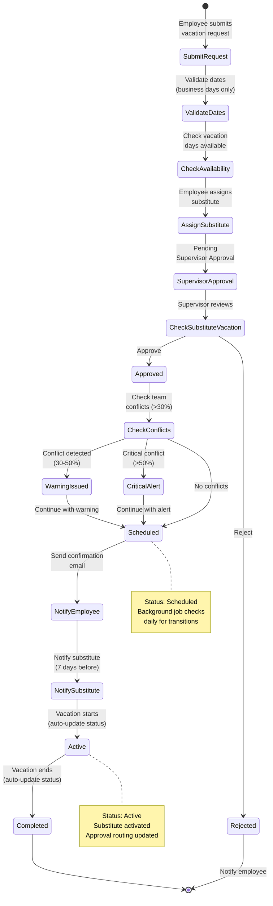
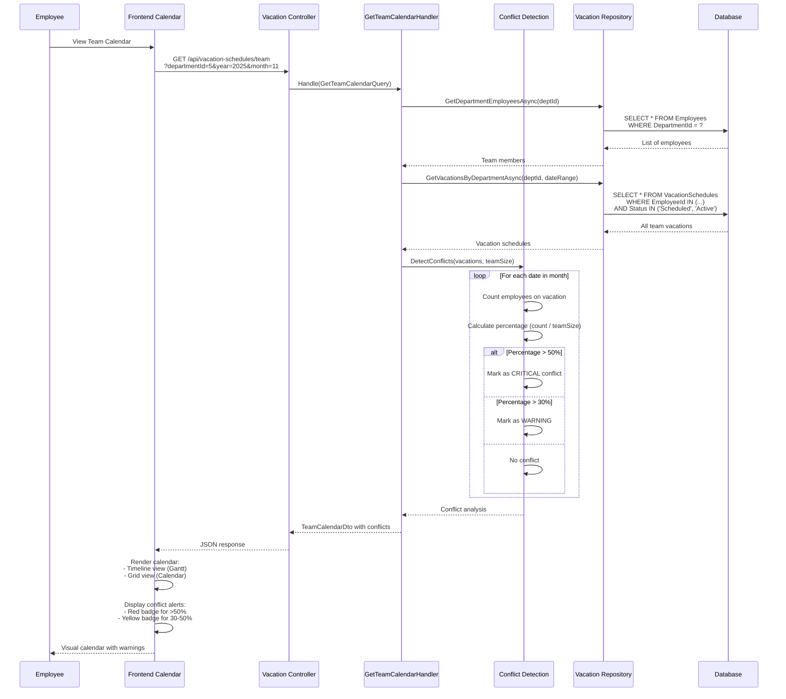
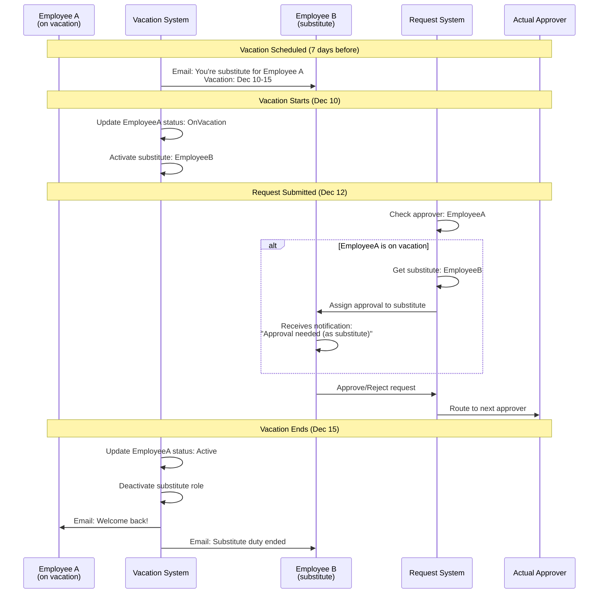
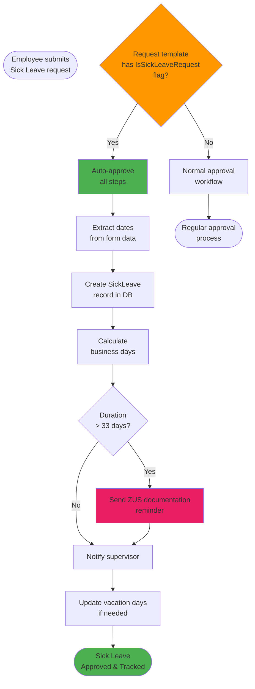
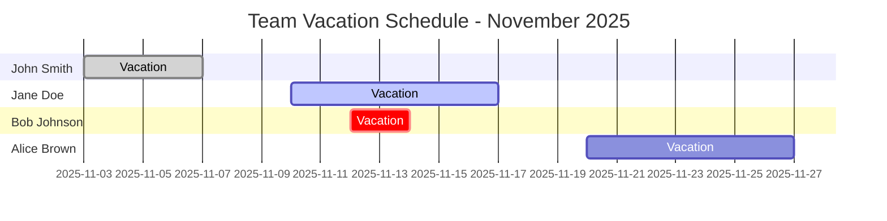

# PortalForge - Vacation Management System

## System Overview

Comprehensive vacation management system with calendar views, conflict detection, substitutions, and automated workflows.

---

## 1. Vacation Request & Approval Flow



---

## 2. Team Calendar with Conflict Detection



---

## 3. Background Jobs Automation

```mermaid
graph TB
    subgraph "Hangfire Background Jobs"
        Scheduler[Hangfire Scheduler]

        Job1[Update Vacation Statuses<br/>Every 6 hours]
        Job2[Send Vacation Reminders<br/>Daily at 8:00 AM]
        Job3[Update Annual Allowances<br/>January 1st yearly]
        Job4[Expire Carried-Over Days<br/>March 31st yearly]
        Job5[Carried-Over Reminders<br/>Weekly in March]
    end

    subgraph "Job 1: Update Statuses"
        CheckScheduled[Check Scheduled<br/>vacations]
        CheckActive[Check Active<br/>vacations]
        UpdateToActive[Start date reached<br/>→ Active]
        UpdateToCompleted[End date passed<br/>→ Completed]
    end

    subgraph "Job 2: Send Reminders"
        Check7Days[Vacation in 7 days<br/>Send reminder]
        Check1Day[Vacation tomorrow<br/>Send reminder]
        CheckStarting[Vacation starts today<br/>Notify substitute]
        CheckEnding[Vacation ends today<br/>Welcome back]
    end

    subgraph "Job 3: Annual Allowances"
        ResetAllowances[Reset annual<br/>vacation days]
        CalculateCarriedOver[Calculate carried-over<br/>from previous year]
        SetExpiryDate[Set expiry date<br/>(March 31st)]
    end

    subgraph "Job 4: Expire Carried-Over"
        FindExpired[Find carried-over days<br/>past March 31st]
        DeductDays[Deduct expired days]
        NotifyUsers[Notify affected users]
    end

    subgraph "Job 5: Expiry Warnings"
        FindExpiring[Find carried-over days<br/>expiring soon]
        SendWarnings[Send weekly reminders<br/>in March]
    end

    Scheduler --> Job1
    Scheduler --> Job2
    Scheduler --> Job3
    Scheduler --> Job4
    Scheduler --> Job5

    Job1 --> CheckScheduled
    Job1 --> CheckActive
    CheckScheduled --> UpdateToActive
    CheckActive --> UpdateToCompleted

    Job2 --> Check7Days
    Job2 --> Check1Day
    Job2 --> CheckStarting
    Job2 --> CheckEnding

    Job3 --> ResetAllowances
    Job3 --> CalculateCarriedOver
    Job3 --> SetExpiryDate

    Job4 --> FindExpired
    Job4 --> DeductDays
    Job4 --> NotifyUsers

    Job5 --> FindExpiring
    Job5 --> SendWarnings

    style Scheduler fill:#FF8A65
    style Job1 fill:#81C784
    style Job2 fill:#64B5F6
    style Job3 fill:#FFD54F
    style Job4 fill:#E57373
    style Job5 fill:#BA68C8
```

---

## 4. Substitute Management Flow



---

## 5. Vacation Allowance Tracking

```mermaid
graph TB
    subgraph "Vacation Days Calculation"
        Annual[Annual Vacation Days<br/>Default: 26 days]
        CarriedOver[Carried-Over from Previous Year<br/>Max: 26 days<br/>Expires: March 31st]
        OnDemand[On-Demand Vacation<br/>Max: 4 days per year]
        Circumstantial[Circumstantial Leave<br/>Special cases]
    end

    subgraph "Days Usage"
        TotalAvailable[Total Available Days]
        DaysUsed[Days Used<br/>(Completed vacations)]
        DaysScheduled[Days Scheduled<br/>(Approved, not started)]
        DaysRemaining[Days Remaining]
    end

    Annual --> TotalAvailable
    CarriedOver --> TotalAvailable
    OnDemand --> TotalAvailable
    Circumstantial --> TotalAvailable

    TotalAvailable --> DaysRemaining
    DaysUsed --> DaysRemaining
    DaysScheduled --> DaysRemaining

    DaysRemaining --> DisplayToUser[Display in UI:<br/>Progress bars<br/>Statistics]

    subgraph "Annual Reset (January 1st)"
        ResetAnnual[Reset Annual to 26]
        MoveToCarriedOver[Unused days → Carried-Over<br/>Max 26]
        ResetOnDemand[Reset On-Demand to 4]
    end

    DaysRemaining --> ResetAnnual
    ResetAnnual --> MoveToCarriedOver
    MoveToCarriedOver --> ResetOnDemand

    subgraph "Expiry (March 31st)"
        CheckCarriedOver[Check Carried-Over Days]
        ExpireDays[Expire days past March 31st]
        NotifyExpiry[Notify users of expiry]
    end

    MoveToCarriedOver --> CheckCarriedOver
    CheckCarriedOver --> ExpireDays
    ExpireDays --> NotifyExpiry

    style Annual fill:#4CAF50
    style CarriedOver fill:#FF9800
    style OnDemand fill:#2196F3
    style Circumstantial fill:#9C27B0
    style DaysRemaining fill:#E91E63
```

---

## 6. Sick Leave (L4) Auto-Approval



---

## 7. Team Calendar UI Views

### Timeline View (Gantt)


### Conflict Detection Logic
- **Normal**: < 30% of team on vacation (green)
- **Warning**: 30-50% of team on vacation (yellow)
- **Critical**: > 50% of team on vacation (red)

---

## Key Features

### ✅ Implemented (95%)

1. **Vacation Request Submission**: Full form with date picker, substitute selection
2. **Approval Workflow**: Supervisor approval with validation
3. **Team Calendar**: Two views (Timeline Gantt, Calendar Grid)
4. **Conflict Detection**: Real-time alerts for 30%/50% thresholds
5. **Substitute System**: Automatic assignment and approval routing
6. **Background Jobs**: 5 automated tasks (status updates, reminders, annual reset, expiry)
7. **Email Notifications**: 7 days before, 1 day before, start, end
8. **Vacation Allowances**: Annual, carried-over, on-demand, circumstantial tracking
9. **Sick Leave L4**: Auto-approval with ZUS reminders for >33 days
10. **Statistics Dashboard**: Personal and team vacation usage

### ⚠️ Partial (5%)

- **PDF/Excel Export**: Endpoints exist, return 501 Not Implemented

---

*Document created: 2025-11-07*
*Version: 1.0*
*For: PortalForge v2.5 - Vacation System Documentation*
