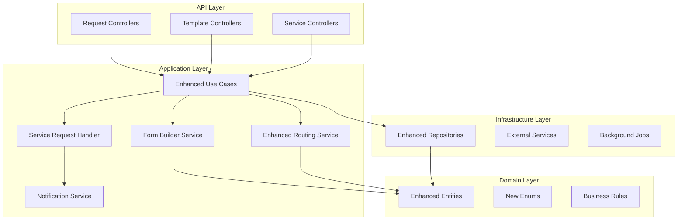

# Design Document - Enhanced Request System

## Overview

This document outlines the design for enhancing the existing PortalForge request system to address current issues with approval processes, user experience, and template management. The design builds upon the existing Clean Architecture, CQRS pattern, and SOLID principles while introducing new capabilities for dynamic form building, improved vacation handling, and service request automation.

## Architecture

### Current Architecture Analysis

The existing system follows Clean Architecture with:
- **Domain Layer**: Entities (Request, RequestTemplate, RequestApprovalStep, etc.)
- **Application Layer**: Use Cases with CQRS pattern, Services, DTOs
- **Infrastructure Layer**: Repositories, External Services, Data Access
- **API Layer**: Controllers, DTOs, Middleware

### Enhanced Architecture Components



## Components and Interfaces

### 1. Enhanced Form Builder System

#### New Enums and Types

```csharp
// Extend existing FieldType enum
public enum FieldType
{
    // Existing types
    Text,
    Textarea,
    Number,
    Select,
    Date,
    Checkbox,
    
    // New types
    FileUpload,
    MultiSelect,
    DateRange,
    Rating,
    Signature,
    ConditionalField,
    UserPicker,
    DepartmentPicker
}

// New validation types
public enum ValidationType
{
    Required,
    MinLength,
    MaxLength,
    Regex,
    Custom,
    Conditional,
    Range,
    FileSize,
    FileType
}
```

#### Enhanced RequestTemplateField

```csharp
public class RequestTemplateField
{
    // Existing properties...
    
    // New properties for enhanced functionality
    public string? ValidationRules { get; set; } // JSON configuration
    public string? ConditionalLogic { get; set; } // JSON rules for showing/hiding
    public bool IsConditional { get; set; }
    public string? DefaultValue { get; set; }
    public string? AutoCompleteSource { get; set; } // API endpoint for suggestions
    public int? FileMaxSize { get; set; } // For file uploads
    public string? AllowedFileTypes { get; set; } // JSON array
}
```

#### Form Builder Service Interface

```csharp
public interface IFormBuilderService
{
    Task<FormDefinitionDto> BuildFormAsync(Guid templateId);
    Task<ValidationResult> ValidateFormDataAsync(Guid templateId, string formData);
    Task<string> ProcessConditionalLogicAsync(Guid templateId, string formData);
    Task<List<AutoCompleteOption>> GetAutoCompleteOptionsAsync(string source, string query);
}
```

### 2. Enhanced Request Processing

#### Service Request Handler

```csharp
public interface IServiceRequestHandler
{
    Task<ServiceRequestResult> ProcessServiceRequestAsync(Request request);
    Task<bool> CanHandleRequestTypeAsync(string requestType);
    Task NotifyServiceTeamAsync(Request request, string serviceCategory);
    Task UpdateServiceTaskStatusAsync(Guid requestId, ServiceTaskStatus status, string notes);
}

public enum ServiceTaskStatus
{
    Assigned,
    InProgress,
    Completed,
    OnHold,
    Cancelled
}
```

#### Enhanced Vacation Calculation Service

```csharp
public interface IEnhancedVacationCalculationService : IVacationCalculationService
{
    // New methods for Polish law compliance
    Task<CircumstantialLeaveResult> ValidateCircumstantialLeaveAsync(
        Guid userId, 
        DateTime startDate, 
        DateTime endDate, 
        string reason,
        bool hasDocumentation);
    
    Task<OnDemandVacationResult> ValidateOnDemandVacationAsync(
        Guid userId, 
        DateTime startDate, 
        DateTime endDate);
    
    Task<VacationConflictResult> CheckVacationConflictsAsync(
        Guid userId, 
        DateTime startDate, 
        DateTime endDate);
    
    Task<int> GetRemainingOnDemandDaysAsync(Guid userId, int year);
}
```

### 3. Enhanced Approval Workflow

#### Parallel Approval Support

```csharp
public class RequestApprovalStepTemplate
{
    // Existing properties...
    
    // New properties for parallel approvals
    public bool IsParallel { get; set; }
    public string? ParallelGroupId { get; set; } // Groups parallel steps
    public int MinimumApprovals { get; set; } = 1; // For parallel steps
    public TimeSpan? EscalationTimeout { get; set; }
    public Guid? EscalationUserId { get; set; }
}
```

#### Enhanced Routing Service

```csharp
public interface IEnhancedRequestRoutingService : IRequestRoutingService
{
    Task<List<User>> ResolveParallelApproversAsync(
        RequestApprovalStepTemplate stepTemplate, 
        User submitter);
    
    Task<bool> ShouldEscalateAsync(RequestApprovalStep step);
    Task EscalateRequestStepAsync(Guid stepId);
    
    Task<List<User>> GetDelegatedApproversAsync(Guid originalApproverId);
    Task SetApprovalDelegationAsync(Guid fromUserId, Guid toUserId, DateTime? until);
}
```

### 4. Enhanced Notification System

#### Smart Notification Service

```csharp
public interface ISmartNotificationService : INotificationService
{
    Task SendGroupedNotificationsAsync(Guid userId, List<NotificationGroup> groups);
    Task<NotificationPreferences> GetUserPreferencesAsync(Guid userId);
    Task UpdateUserPreferencesAsync(Guid userId, NotificationPreferences preferences);
    Task SendDigestNotificationAsync(Guid userId, DigestType type);
    Task SendRealTimeNotificationAsync(Guid userId, string message, NotificationType type);
}

public class NotificationPreferences
{
    public bool EmailEnabled { get; set; } = true;
    public bool InAppEnabled { get; set; } = true;
    public bool DigestEnabled { get; set; } = false;
    public DigestFrequency DigestFrequency { get; set; } = DigestFrequency.Daily;
    public List<NotificationType> DisabledTypes { get; set; } = new();
}
```

## Data Models

### Enhanced Request Entity

```csharp
public class Request
{
    // Existing properties...
    
    // New properties for enhanced functionality
    public string? ServiceCategory { get; set; } // For service requests
    public ServiceTaskStatus? ServiceStatus { get; set; }
    public DateTime? ServiceCompletedAt { get; set; }
    public string? ServiceNotes { get; set; }
    public bool IsTemplate { get; set; } = false; // For request templates/cloning
    public Guid? ClonedFromId { get; set; } // Reference to original request
    public string? Tags { get; set; } // JSON array for categorization
}
```

### New Entities

#### RequestAnalytics

```csharp
public class RequestAnalytics
{
    public Guid Id { get; set; }
    public Guid UserId { get; set; }
    public User User { get; set; } = null!;
    
    public int TotalRequests { get; set; }
    public int ApprovedRequests { get; set; }
    public int RejectedRequests { get; set; }
    public int PendingRequests { get; set; }
    
    public double AverageProcessingTime { get; set; } // In hours
    public DateTime LastCalculated { get; set; }
    public int Year { get; set; }
    public int Month { get; set; }
}
```

#### ApprovalDelegation

```csharp
public class ApprovalDelegation
{
    public Guid Id { get; set; }
    public Guid FromUserId { get; set; }
    public User FromUser { get; set; } = null!;
    
    public Guid ToUserId { get; set; }
    public User ToUser { get; set; } = null!;
    
    public DateTime StartDate { get; set; }
    public DateTime? EndDate { get; set; }
    public bool IsActive { get; set; } = true;
    
    public string? Reason { get; set; }
    public DateTime CreatedAt { get; set; }
}
```

## Error Handling

### Enhanced Validation System

```csharp
public class RequestValidationService
{
    public async Task<ValidationResult> ValidateRequestAsync(Request request)
    {
        var result = new ValidationResult();
        
        // Form data validation
        await ValidateFormDataAsync(request, result);
        
        // Business rules validation
        await ValidateBusinessRulesAsync(request, result);
        
        // Vacation-specific validation
        if (request.LeaveType.HasValue)
        {
            await ValidateVacationRequestAsync(request, result);
        }
        
        // Service request validation
        if (!string.IsNullOrEmpty(request.ServiceCategory))
        {
            await ValidateServiceRequestAsync(request, result);
        }
        
        return result;
    }
}
```

### Error Types

```csharp
public enum RequestErrorType
{
    ValidationError,
    BusinessRuleViolation,
    VacationConflict,
    InsufficientVacationDays,
    ApprovalStructureError,
    ServiceCategoryNotFound,
    DocumentationRequired,
    EscalationTimeout
}
```

## Testing Strategy

### Unit Testing Approach

1. **Domain Logic Testing**
   - Business rules validation
   - Vacation calculation logic
   - Approval workflow logic

2. **Service Testing**
   - Form builder service
   - Enhanced routing service
   - Notification service

3. **Integration Testing**
   - End-to-end request submission flow
   - Approval workflow testing
   - Service request processing

### Test Categories

```csharp
// Example test structure
[TestClass]
public class EnhancedVacationCalculationServiceTests
{
    [TestMethod]
    public async Task ValidateCircumstantialLeave_WithValidDocumentation_ShouldSucceed()
    {
        // Test Polish law compliance for circumstantial leave
    }
    
    [TestMethod]
    public async Task ValidateOnDemandVacation_ExceedingLimit_ShouldFail()
    {
        // Test 4-day annual limit for on-demand vacation
    }
}
```

## Implementation Phases

### Phase 1: Enhanced Form Builder
- Extend FieldType enum
- Implement FormBuilderService
- Create drag-and-drop UI components
- Add real-time form preview

### Phase 2: Improved Vacation Handling
- Enhance VacationCalculationService
- Implement Polish law business rules
- Add conflict detection
- Create vacation analytics

### Phase 3: Service Request Automation
- Implement ServiceRequestHandler
- Add automatic routing to service teams
- Create service task tracking
- Build service dashboard

### Phase 4: Advanced Approval Workflows
- Add parallel approval support
- Implement escalation rules
- Create delegation functionality
- Build bulk approval features

### Phase 5: Smart Notifications
- Enhance notification system
- Add real-time notifications
- Implement digest notifications
- Create notification preferences

## Security Considerations

### Authorization Enhancements

```csharp
public static class RequestPermissions
{
    public const string ViewAllRequests = "requests.view.all";
    public const string ApproveRequests = "requests.approve";
    public const string ManageTemplates = "templates.manage";
    public const string ViewAnalytics = "analytics.view";
    public const string DelegateApprovals = "approvals.delegate";
    public const string ManageServiceRequests = "service.manage";
}
```

### Data Protection

- Encrypt sensitive form data
- Audit all request modifications
- Implement data retention policies
- Ensure GDPR compliance for personal data

## Performance Considerations

### Optimization Strategies

1. **Caching**
   - Cache form templates
   - Cache user hierarchy data
   - Cache vacation calculations

2. **Database Optimization**
   - Index frequently queried fields
   - Optimize approval step queries
   - Implement pagination for large datasets

3. **Background Processing**
   - Process notifications asynchronously
   - Calculate analytics in background jobs
   - Handle file uploads asynchronously

## Migration Strategy

### Database Migrations

1. Add new columns to existing tables
2. Create new tables for enhanced features
3. Migrate existing data to new structure
4. Update indexes and constraints

### Code Migration

1. Extend existing interfaces
2. Implement new services alongside existing ones
3. Gradually migrate use cases
4. Update frontend components incrementally

This design maintains backward compatibility while introducing powerful new features that address the identified issues with the current request system.